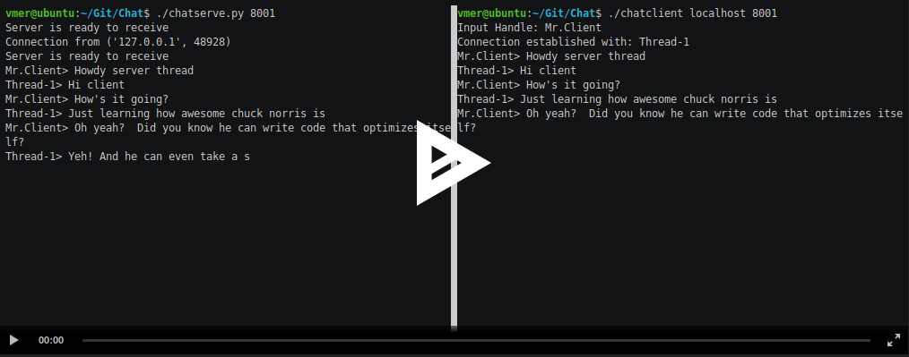

# Chat Server and Client

<p align="center"><a href="http://159.89.136.195:3000/a/21"></a></p>

## Overview
This multi-lingual chat application uses a c++ client to communicate with a multi-threaded python chat server

## Link to Assignment

[Chat](http://159.89.136.195:3000/a/21)

## Setup

#### Build Chat Client

```sh
cmake .
make
```

#### Setup Chat Server

```sh
chmod +x chatserv.py
```

#### Run Chat Client

```sh
./chatclient [hostname] [port]
```

#### Run Chat Server
```sh
./chatserv.py [port]
```

## Improvements
- Allow for parallel chat communication instead of sequential
- Add separate chat input and output windows
- Convert to peer-to-peer communication instead of client-to-server
- Encrypt communication with public-key cryptogrpahy
